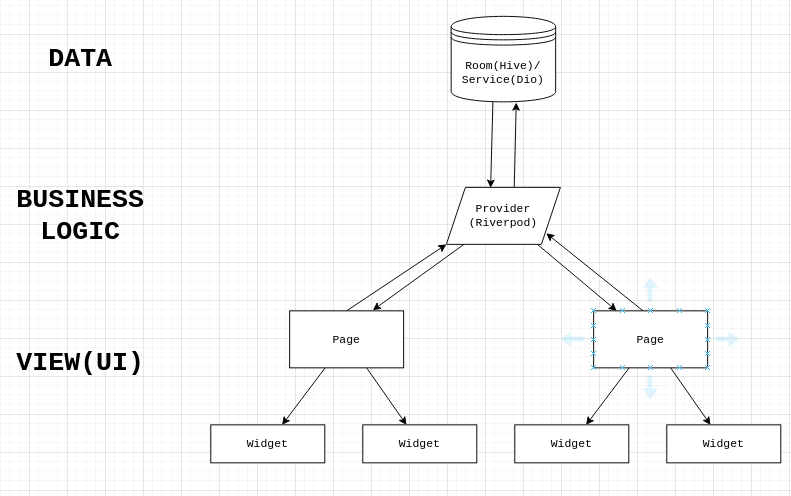

# Echion - Music Streaming App

<div align="center">


<br/>


**A modern music streaming application built with Flutter featuring song playback, upload, and offline caching.**

</div>

## Features

- **User Authentication** - Login and signup with secure token-based auth
- **Music Streaming** - Stream songs directly from the API
- **Song Upload** - Upload your own songs with thumbnails
- **Song Management** - Edit and delete your uploaded songs
- **Offline Caching** - Songs are cached for offline playback
- **Theme Support** - Light, dark, and system theme modes
- **Search** - Search songs by title or artist

## Tech Stack

| Category         | Technology                 |
| ---------------- | -------------------------- |
| Framework        | Flutter 3.32               |
| Language         | Dart 3.10                  |
| State Management | flutter_riverpod 3.2.0     |
| HTTP Client      | dio 5.7.0                  |
| Local Storage    | hive_flutter 1.1.0         |
| Audio Player     | just_audio 0.10.5          |
| Image Caching    | cached_network_image 3.4.1 |
| File Picker      | file_picker 10.3.8         |
| App Icon         | flutter_launcher_icons 0.14.0 |
| Splash Screen    | flutter_native_splash 2.2.11|

## API Endpoints

The app connects to a REST API with the following endpoints:

| Method | Endpoint                  | Description       |
| ------ | ------------------------- | ----------------- |
| POST   | `/auth/signup`            | Register new user |
| POST   | `/auth/login`             | Login user        |
| GET    | `/auth/`                  | Get current user  |
| GET    | `/songs/getall`           | Get all songs     |
| GET    | `/songs/me`               | Get user's songs  |
| POST   | `/songs/upload`           | Upload new song   |
| PUT    | `/songs/update/{song_id}` | Update song       |
| DELETE | `/songs/delete/{song_id}` | Delete song       |

## Architecture



## Project Structure

```
lib/
├── app/                   # App configuration, routes, and themes
├── core/                  # Shared utilities & widgets
│   ├── data/              
│   ├── constants/              
│   ├── dio/               # dio client setup
│   ├── utils/             
│   └── widgets/           
├── features/              # Feature modules
│   ├── auth/              # Authentication
│   │   ├── data/          
│   │   ├── presentation/  
│   │   └── providers/     
│   ├── songs/             # Songs feature
│   │   ├── data/          
│   │   ├── presentation/  
│   │   └── providers/     
│   └── settings/          # App settings
│       ├── presentation/  
│       └── providers/        
└── main.dart              # App entry point
```

## Getting Started

### Prerequisites

- Flutter SDK 3.32+
- Dart SDK 3.10+
- Android Studio / VS Code

### Installation

```bash
# Clone the repository
git clone https://github.com/dirgaydtm/echion.git
cd echion

# Install dependencies
flutter pub get

# Generate app icon and splash screen
dart run flutter_launcher_icons
dart run flutter_native_splash:create

# Run the app
flutter run
```

### Build APK

```bash
flutter build apk --release
```


## License

This project is open source and available under the [MIT License](LICENSE).